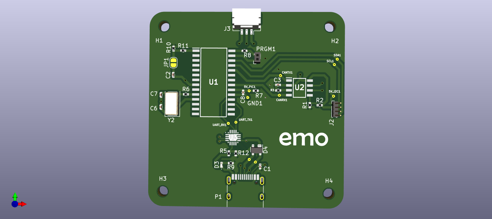

# On board diagnostic tool: developed for EMO energy pvt ltd. 
## On Board diagnostic tool is a simple PCB that can be interfaced with the internal battery management system that cannot be accessed during the maintence or diagnostics of the battery pack 

<!--Table  of contents
- [section 1](#section-1)
- [section 2](#section-2)-->


*The priamry functionn of the OBD tool:*
1. Communicate via controller area network (CAN) protocol to the battery and
request the BMS to send necessary data.
2. Communicate via the Universal serial asynchronous RX-TX protocol to the GUI
and deliver the data in human readable from.

*The following operations are implemenetd*
1. Request real time data containing cell voltages, pack voltage, pack current,
temperatures, error and faults from the BMS and transmit to the USB via UART
in the form of strings appended with certain identifiers.
2. Request the configuration parameters from the BMS that was already uploaded
upon getting a command request from the GUI
3. Push the new configuration parameters to the BMS on command request from the
GUI.
4. Request SD card data to be downloaded on request from the GUI.
5. Change baud rates of UART and CAN upon command request from GUI
6. Flow control between OBD and BMS whenever there is an event of exchanging
data.

## 
- Microcontroller unit: Microchip PIC18F27Q84
- CAN transciever: Microchip MCP2551; variable Baud rate upto 1Mbps
- UART to USB converter: Silicon labs CP2102; variable baud rate uptp 115200
- Micrchip MPLAB X IDE

<!-- > some block quote itseems -->

<!-- `this is where code comes` -->

----------------
<!--
[We can post any link if you want] (https://github.com/darshanram008/EMO_OBD_tool/edit/main/README.md)



This is a footnote, you press this it will take you to the footnote. [^1]
Note: Footnotes are always at the end of this file.
## SECTION 1
> This is table


|   Left side     | Right side     |
|-------------|------------|
| 1. The advantage is good | 1. The advantage is bad |
| 2. The advantage is good | 2. The advantage is bad |
| 3. The advantage is good | 3. The advantage is bad |
| 4. The advantage is good | 4. The advantage is bad |

```
{
   \\This is fenced code 
  if (count == 0)
  {
  printf("Hello, zeros"):  
  }

}
```
## SECTION 2
> Definitions

UART
: Universal Asyncronous receiver and transmitter

CAN
: Controller area network

~~Strikeout anything~~

- [x] Task completed
- [x] Task completed
- [ ] Task Incomplete
- [ ] Task incomplete

There are emoji as well! :joy:

i have more :angry:

take more 📶

==Some very important points==.

to put subscript you can do this H<sub>2</sub>O

To put superscript do this X<sup>2</sup>Y

[^1]: This is the footnote, you can add any references you want. 


